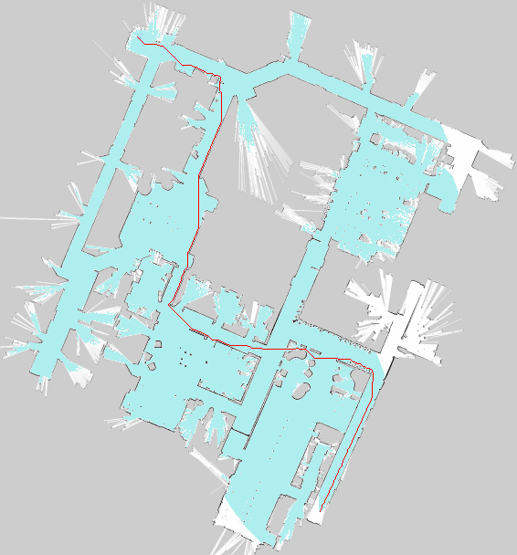

# cpp-graph-planner

Small project to review C++ after reading [A Tour of C++](https://www.stroustrup.com/tour2.html). The library allows to build 
directed and undirected graphs. Nodes are indexed with `(x, y)` coordinates on a 2D grid. Graphs support pathfinding with
A* based on the [Wikipedia pseudocode](https://en.wikipedia.org/wiki/A*_search_algorithm).

The `OccupancyGraph` class uses to the above tools to build graphs directly from `pgm` files representing occupancy maps.



# Install
[OpenCV](https://docs.opencv.org/4.x/d7/d9f/tutorial_linux_install.html) is required for handling the `pgm` files and
visualizing paths. You can then build the `Graph` library and executables with

```bash
mkdir build
cd build
cmake ..
make
```
# Usage
For a simple example of how to build graphs, inspect `line-graph.cpp` and run
```bash
./line-graph
```

# Occupancy Grid Maps
The map should be encoded as a `pgm` file. You can generate simple maps with 
```bash
mkdir maps
./default-maps maps
```
then solve the path between `(1, 1)` and `(99, 99)` in an empty map with
```bash
./occupancy-planner maps/map_empty.pgm maps 1 1 99 99
```

`occupancy-planner` will run A* with three heuristics (No heuristic, Taxicab and Euclidean) and report results. Paths
are also rendered and saved as images in the output directory (here `maps`). The path is rendered with **red** pixels 
while visited cells are rendered as **blue** pixels.

The code was also tested with more interesting maps, like [this one](https://github.com/turtlebot/turtlebot_apps/blob/indigo/turtlebot_navigation/maps/willow-2010-02-18-0.10.pgm)
with the following command
```bash
./occupancy-planner maps/willow-2010-02-18-0.10.pgm maps 40 150 560 350
```
An example output image is at the top of this README.


